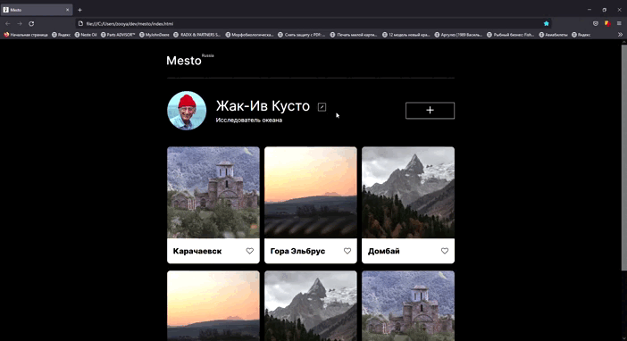

# Проект: Место

### Обзор
Сайт-фотоальбом с простым и интуитивным интерфейсом. Пользователь может заполнить информацию о себе, выложить личные фотографии и дополнить их подписями. Другие посетители профиля могут оставлять реакции на фотографии оставляя лайки под фото.

***
Интерактив сайта реализован с помощью JavaScript (открытие/закрытие модального окна, заполнение формы).

***

**Figma**

* [Ссылка на макет в Figma](https://www.figma.com/file/2cn9N9jSkmxD84oJik7xL7/JavaScript.-Sprint-4?node-id=0%3A1)

**Githab Pages**
* [Ссылка на проект]()

**Предварительный просмотр**

